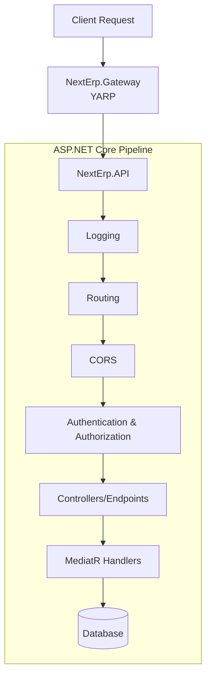

# NextErp

NextErp is a **modular, clean architecture-based enterprise resource planning (ERP) backend** built on **.NET 8**, using **Entity Framework Core**, **MediatR**, and **REST APIs**. This project demonstrates modern software engineering practices, including **Domain-Driven Design (DDD)**, **CQRS (Command Query Responsibility Segregation)**, **Repository & Unit of Work patterns**, **DTOs with AutoMapper**, and **metadata-based optimization** for reduced data load.

---

## Table of Contents

1. [Features](#features)  
2. [Architecture & Patterns](#architecture--patterns)  
3. [Tech Stack & Tools](#tech-stack--tools)  
4. [Database & Metadata Handling](#database--metadata-handling)  
5. [Services & Controllers](#services--controllers)  
6. [API Gateway (YARP)](#api-gateway-yarp)
7. [Setup & Migration](#setup--migration)  
8. [Usage](#usage)  
9. [Future Improvements](#future-improvements)  

---

## Features

### Product Module
- Full CRUD with paging, sorting, and filtering.
- Automatic category product count updates.
- Metadata JSON for dynamic attributes and parent-child variations.

### Category Module
- CRUD with self-referencing for hierarchies.
- Metadata JSON for product counting and dynamic info.

### API Features
- RESTful endpoints with **Swagger documentation**.
- **CQRS Pattern** using MediatR for clean separation of commands and queries.
- **AutoMapper** integration for seamless Entity-DTO mapping.
- Error handling using global exception handling and try/catch blocks.
- DTO-based request/response separation to avoid overfetching.
- Pagination, sorting, and search for efficient data retrieval.

---

## Architecture & Patterns

### Clean Architecture Layers

1. **NextErp.Domain**
   - Core Entities: `Product`, `Category`, `Branch`, `Tenant`, etc.
   - Interfaces for repositories and domain services.
   - Pure domain logic with no external dependencies.

2. **NextErp.Application**
   - Business logic and use cases.
   - **CQRS**: Commands (Write) and Queries (Read) handled via MediatR.
   - **DTOs**: Data Transfer Objects for API communication.
   - **Mappings**: AutoMapper profiles for converting between Entities and DTOs.
   - Validators and Application Services.

3. **NextErp.Infrastructure**
   - EF Core `DbContext` implementation.
   - Repository implementations (`Repository<T>`).
   - Database migrations and configuration.
   - Metadata JSON column handling.

4. **NextErp.API** (Web Layer)
   - REST API Controllers.
   - Dependency Injection configuration.
   - Middleware (Error handling, Authentication).
   - Swagger/OpenAPI configuration.

5. **NextErp.Gateway** (API Gateway)
   - Built with **YARP (Yet Another Reverse Proxy)**.
   - Programmatic route and cluster configuration via `IGatewayConfigProvider`.
   - Custom middleware and transformations for request routing.
   - Central entry point for all client requests.

---

### Key Patterns Used
- **Clean Architecture** – Separation of concerns into Domain, Application, Infrastructure, and API.
- **CQRS (Command Query Responsibility Segregation)** – Separates read and write operations using MediatR.
- **Repository Pattern** – Abstracts data access logic.  
- **Unit of Work Pattern** – Manages transactions across multiple repositories.  
- **DTO Pattern** – Separates request/response objects from domain entities.  
- **AutoMapper** – Simplifies mapping between entities and DTOs.  
- **Self-referencing Entities** – Categories and products can have parent-child relationships.  
- **Metadata JSON Column** – Stores additional entity data dynamically to reduce joins and queries.  

---

## Tech Stack & Tools

- **Backend**: .NET 8 Core, C#  
- **ORM**: Entity Framework Core 8
- **Mediator**: MediatR
- **Mapping**: AutoMapper
- **Database**: SQL Server (LocalDB or SQL Express)  
- **Authentication**: ASP.NET Identity (JWT)
- **Logging**: Serilog (File-based)  
- **API Documentation**: Swagger / Swashbuckle  
- **API Gateway**: YARP (Yet Another Reverse Proxy)
- **Frontend**: Razor Pages (Admin Area) with Bootstrap 5 (AdminLTE removed for simplicity)

---

## Database & Metadata Handling

- **Products**
  - Columns: `Id`, `Title`, `Code`, `Price`, `Stock`, `CategoryId`, `ParentId`, `Metadata`, etc.
  - `Metadata` is a JSON column that stores dynamic attributes such as `ExtraSpecs`, `Discounts`, etc.
- **Categories**
  - Columns: `Id`, `Title`, `ParentId`, `Metadata`, etc.
  - `Metadata` stores dynamic info like `ProductCount` for efficient querying.

**Benefits of Metadata JSON:**
- Avoids schema changes for minor additions.
- Reduces unnecessary joins for dynamic attributes.
- Lightweight and flexible for front-end consumption.

---

## Services & Controllers

### Application Services (CQRS)
- **Commands**: `CreateProductCommand`, `UpdateCategoryCommand`, etc. encapsulate write logic.
- **Queries**: `GetProductByIdQuery`, `GetAllCategoriesQuery` encapsulate read logic.
- **Handlers**: MediatR handlers execute the logic for each command/query.

### Controllers
- Thin controllers that delegate work to MediatR.
- Return standard HTTP responses (200 OK, 201 Created, 400 Bad Request, 404 Not Found).

---

## API Gateway (YARP)

NextErp uses **YARP** as a high-performance API Gateway. It is designed to handle cross-cutting concerns like authentication, rate limiting, and request routing across multiple microservices (or modules).

- **Dynamic Configuration**: Routes and clusters can be updated at runtime without restarting the gateway.
- **Middleware Integration**: Seamlessly integrates with ASP.NET Core middleware for custom logic.
- **Service Discovery**: Abstracts the underlying service locations, allowing for easy scaling and failover.

The Gateway is configured in `NextErp.Gateway/Program.cs` and can be extended with custom transforms.

### Middleware Pipeline Flow



---

## Setup & Migration

1. **Prerequisites**:
   - .NET 8 SDK
   - SQL Server (LocalDB or Express)

2. **Configuration**:
   Update `appsettings.json` in `NextErp.API` with your connection string:

   ```json
   "ConnectionStrings": {
     "DefaultConnection": "Server=(localdb)\\MSSQLLocalDB;Database=NextErpDb;Integrated Security=True;TrustServerCertificate=True;"
   }
   ```

3. **Database Migration**:
   Open a terminal in the solution root and run:
   ```bash
   dotnet ef database update --project NextErp.Infrastructure --startup-project NextErp.API
   ```

4. **Run API Gateway**:
   ```bash
   dotnet run --project NextErp.Gateway
   ```
   The gateway typically listens on `https://localhost:7000` (port may vary) and forwards requests to `NextErp.API`.

Access Swagger at `https://localhost:7245/swagger` (Direct API) or via Gateway if configured.

---

## Usage

- **API**: Use Swagger UI to test endpoints.
- **Admin Panel**: Access `/Admin` for the web interface (if configured).

## Future Improvements

- [ ] Implement comprehensive Unit Tests (xUnit/NUnit).
- [ ] Add Redis caching for high-performance reads.
- [ ] Implement real-time notifications using SignalR.
- [ ] Containerization with Docker.
